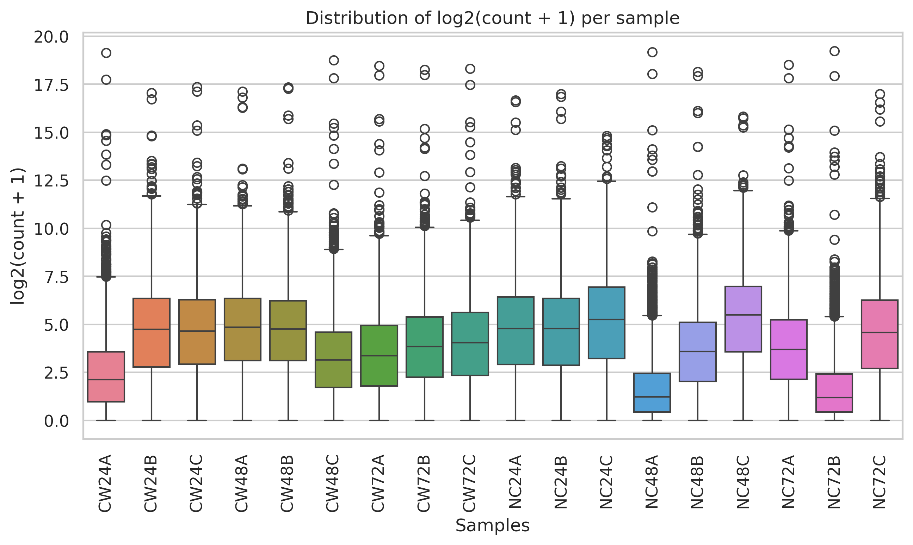
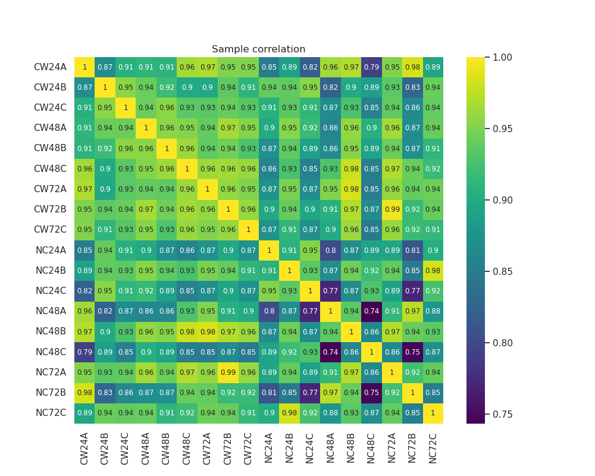
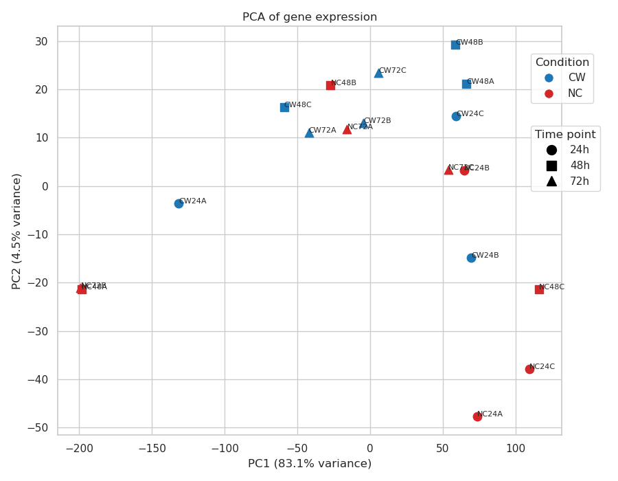
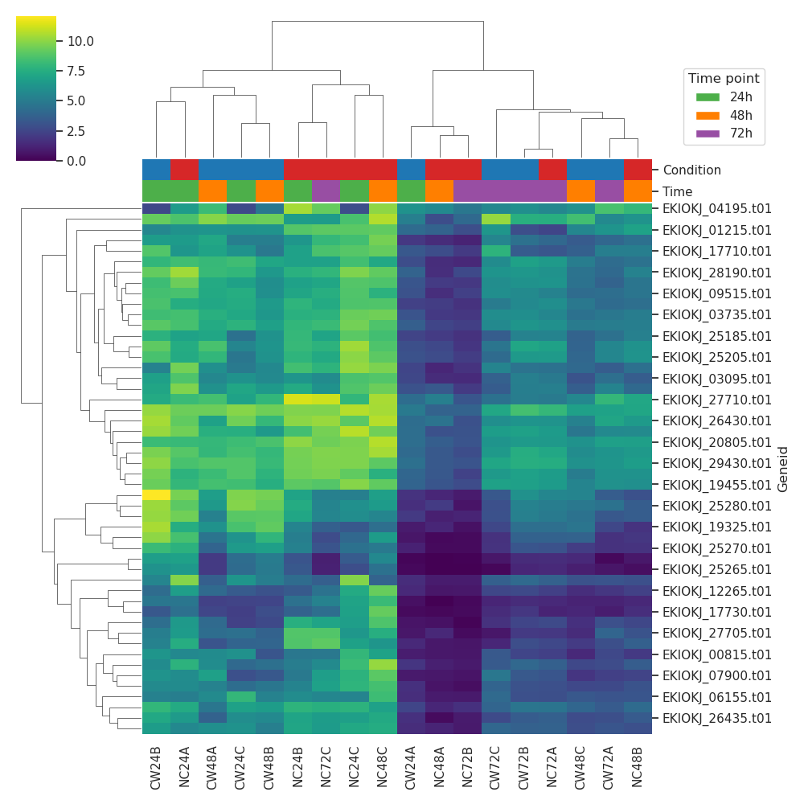
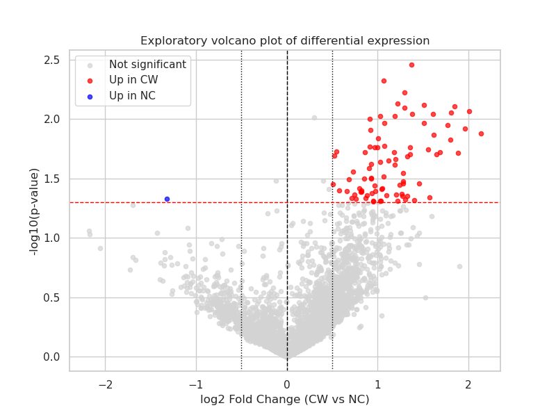

# RNA-seq Analysis of Bacterial Gene Expression

**Author :** Romain Miranda-Capet

---

## Project structure

projet_01_rnaseq-pseudomonas-analysis

│

├── data

│   └── Raw

│      └── GSE267862_count_matrix.txt

│

├── figures

│   ├── sample_distribution.png

│   ├── correlation_heatmap.png

│   ├── PCA.png

│   ├── clustered_heat_map.png

│   └── volcano_plot.png

│

├── notebooks

│   └── 01_rnaseq_analysis_pseudomonas.ipynb

│

├── README.md

└── requirements.txt

---

# RNA-seq Analysis of Bacterial Gene Expression

**Author :** Romain Miranda-Capet

---

# 1. Project Overview

This project explores a real RNA-seq dataset to investigate differences in bacterial gene expression across experimental conditions.

My academic background is in **molecular microbiology**, where I worked on bacterial interactions, plasmid transfer, and experimental data analysis. Through this project, I apply **data analysis and data science methods** to a biologically meaningful dataset while building a **reproducible analytical workflow suitable for a professional portfolio**.

RNA-seq datasets present several challenges typical of complex data analysis :

- high dimensionality
- variability between samples
- normalization requirements
- extraction of biologically interpretable patterns

The purpose of this project is therefore twofold :

1. explore transcriptional patterns in a bacterial RNA-seq dataset  
2. demonstrate transferable **data science skills for complex data analysis**

---

# 2. Biological Background

RNA sequencing (RNA-seq) allows the quantification of gene expression levels across the genome by counting sequencing reads aligned to genes.

The dataset analyzed here investigates the transcriptional response of **_Pseudomonas aeruginosa_** under conditions associated with **oxidative stress in chronic wounds**.

Understanding how bacteria adapt to hostile environments such as chronic wounds can provide insights into microbial survival strategies and potentially reveal genes involved in stress tolerance.

The central question explored in this notebook is :

**Do the experimental conditions produce distinguishable transcriptional signatures, and which genes appear to drive these differences?**

---

# 3. Dataset Description

The dataset used in this project is publicly available from the **Gene Expression Omnibus (GEO)** database.

**GEO accession :**  
GSE267862

The dataset contains **RNA-seq gene count data** measured across multiple conditions.

## Experimental design

Two biological conditions :

- **CW** - Chronic wound environment  
- **NC** - Non-chronic control condition  

Three timepoints :

- 24 hours  
- 48 hours  
- 72 hours  

Three biological replicates per condition and timepoint.

Total samples : *2 conditions × 3 timepoints × 3 replicates = 18 samples*

Total genes : *~6500 genes.*

The dataset therefore represents a **high-dimensional gene expression matrix**, making it suitable for exploratory multivariate analysis.

---

# 4. Analysis Workflow

The analysis is implemented in Python using a **reproducible Jupyter notebook workflow**.

The pipeline follows these steps :

## 1. Data loading

- import RNA-seq count matrix  
- inspect dataset structure  
- organize samples by condition and timepoint  

## 2. Quality control

Inspection of sequencing depth through **library size analysis** to detect potential outliers.

## 3. Normalization

Raw read counts are normalized using **Counts Per Million (CPM)** : CPM = counts / total counts per sample × 1e6

A log transformation is then applied : log2(CPM + 1)

This transformation stabilizes variance and facilitates downstream analysis.

## 4. Exploratory Data Analysis (EDA)

Initial exploration of the data includes :

- distribution of expression values  
- inspection of sample variability  
- correlation analysis between samples  

## 5. Dimensionality reduction

Principal Component Analysis (**PCA**) is used to visualize global relationships between samples and detect potential clustering patterns.

## 6. Variance analysis

The most variable genes across samples are identified and visualized using a **clustered heatmap**.

This step highlights genes contributing most strongly to expression variability.

## 7. Differential expression analysis (exploratory)

A simplified differential expression analysis compares : *CW vs NC*

Steps include :

- computation of mean expression per condition  
- calculation of **log2 fold change**  
- statistical testing using Welch's t-test  
- p-value adjustment using **Benjamini–Hochberg FDR**

## 8. Volcano plot visualization

A volcano plot summarizes differential expression by displaying :

- log2 fold change  
- statistical significance

Genes with stronger differential expression appear farther from the center of the plot.

## 9. Identification of candidate genes

Genes showing the strongest expression differences are extracted for further inspection.

---

# 5. Example Results

### Distribution of transformed counts

This histogram shows the distribution of gene expression values after log2 transformation.  
The transformation reduces the strong right-skew typically observed in raw RNA-seq count data and makes the distribution more suitable for downstream statistical analyses.

---

### Sample correlation heatmap

Pairwise correlations between samples were computed to assess global similarity in gene expression profiles.  
Highly correlated samples indicate consistent sequencing and preprocessing.

---

### Principal Component Analysis (PCA)

Principal Component Analysis was used to visualize global transcriptomic variation between samples.  
This dimensionality reduction technique allows identification of clustering patterns and potential separation between experimental conditions.

---

### Most variable genes heatmap

The heatmap highlights the top most variable genes across samples, revealing patterns of coordinated gene expression and potential biological signals.

---

### Volcano plot of differential expression

The volcano plot summarizes differential expression results between CW and NC conditions.  
Genes with both large fold-change and statistically significant p-values are highlighted, revealing a subset of genes strongly upregulated in the CW condition.

---

# 6. Key Results

The exploratory analysis reveals several genes with increased expression in the **chronic wound condition (CW)**.

These genes may be associated with bacterial responses to oxidative stress environments encountered in chronic wounds.

However, this analysis uses a simplified statistical framework and should therefore be interpreted cautiously. The results primarily serve as an **exploratory investigation of the dataset rather than definitive biological conclusions**.

---

# 7. How to Reproduce the Analysis

Clone the repository : git clone https://github.com/RomainMC-Sci/projet_01_rnaseq-pseudomonas-analysis.git

Install required Python packages : pip install -r requirements.txt

Launch Jupyter lab

Open the notebook : notebooks/01_rnaseq_analysis_pseudomonas.ipynb

Run all cells to reproduce the analysis.

---

# 8. Technologies Used

- Python  
- NumPy  
- Pandas  
- Matplotlib  
- Seaborn  
- SciPy  
- Statsmodels  
- Scikit-learn  
- Jupyter Notebook  

---

# 9. Skills Demonstrated

This project demonstrates several transferable data science competencies :

- handling high-dimensional datasets
- building reproducible analytical workflows
- exploratory data analysis
- statistical hypothesis testing
- dimensionality reduction techniques
- scientific visualization
- interpretation of complex datasets

These skills are applicable well beyond bioinformatics and are widely used across data-driven fields.

---

This project uses publicly available data from the GEO database.
